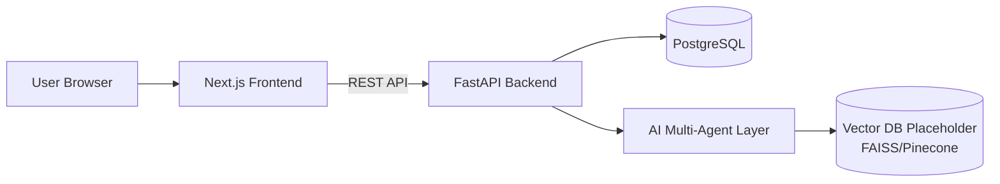
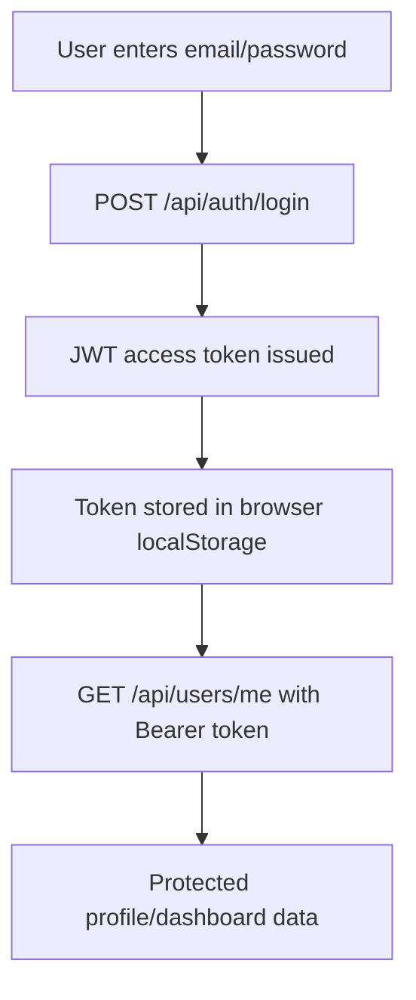
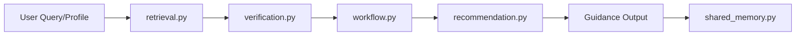

--

## 1. Project Overview

### 1.1 Project Goal
CollegeSodhpuch is an AI-assisted web platform designed to guide international students through university applications and visa preparation. The system consolidates scattered academic and immigration information into one structured workflow.

### 1.2 Problem Being Solved
Students currently rely on fragmented internet sources and expensive consultancies for admissions and visa guidance. This causes misinformation, delays, and financial burden. The platform addresses this by centralizing information and providing guided, verified support.

### 1.3 Intended Users / Context
- Primary users: International students planning higher education abroad
- Secondary users: Students needing document checklists, timeline reminders, and application process support
- Usage context: Web access on desktop/mobile during research, application, and visa planning phases

### 1.4 Current Development Stage
The project is in the **foundation implementation stage**:
- Full-stack project scaffold created
- FastAPI backend running with JWT authentication boilerplate
- Next.js frontend pages for home, login, and dashboard
- PostgreSQL integration via async SQLAlchemy ORM
- AI multi-agent folder structure prepared with CrewAI-ready stubs
- Docker Compose environment configured for local orchestration

---

## 2. Design Illustrations

### Figure 1. System Architecture Diagram



**Explanation:** This diagram represents the layered architecture of the platform. The frontend handles interaction, the backend handles business logic/authentication, PostgreSQL stores user/application data, and the AI layer handles retrieval/verification/recommendation workflows.

### Figure 2. Authentication and Access Flow



**Explanation:** This flowchart shows how login is implemented end-to-end. JWT is used for protected route access and session continuity at the frontend level.

### Figure 3. Initial Database Schema (Core)

```mermaid
erDiagram
    USERS {
        int id PK
        string email UNIQUE
        string full_name
        string hashed_password
        bool is_active
        datetime created_at
    }
```

**Explanation:** The current schema includes the core `users` table required for authentication and dashboard personalization. This schema is intentionally minimal for iterative development.

### Figure 4. AI Agent Pipeline (Stubbed)



**Explanation:** This algorithm flow illustrates planned multi-agent sequencing. Although currently stubbed, each module already exists with callable interfaces for future CrewAI orchestration.

---

## 3. Implementation and Sample Code

### 3.1 FastAPI App Initialization and Routing

```python
@asynccontextmanager
async def lifespan(_: FastAPI):
    async with engine.begin() as conn:
        await conn.run_sync(Base.metadata.create_all)
    yield

app = FastAPI(title=settings.app_name, debug=settings.debug, lifespan=lifespan)
app.include_router(health.router, prefix="/api")
app.include_router(auth.router, prefix="/api")
app.include_router(users.router, prefix="/api")
```

**Purpose:** Initializes FastAPI, ensures database tables are created at startup, and mounts modular routers.  
**System Fit:** This is the backend entrypoint that connects API modules into one service.  
**Design Decision:** Async lifespan + modular routers keep the backend maintainable and scalable.

### 3.2 JWT Authentication Endpoint

```python
@router.post("/login", response_model=Token)
async def login(
    form_data: OAuth2PasswordRequestForm = Depends(),
    db: AsyncSession = Depends(get_db),
) -> Token:
    result = await db.execute(select(User).where(User.email == form_data.username))
    user = result.scalar_one_or_none()

    if user is None or not verify_password(form_data.password, user.hashed_password):
        raise HTTPException(status_code=status.HTTP_401_UNAUTHORIZED, detail="Incorrect email or password")

    token = create_access_token(subject=user.email)
    return Token(access_token=token, token_type="bearer")
```

**Purpose:** Validates credentials and issues JWT access token.  
**System Fit:** Enables secure access to protected resources like dashboard/profile endpoints.  
**Design Decision:** `OAuth2PasswordRequestForm` keeps login API standard and compatible with FastAPI auth tooling.

### 3.3 Frontend Login Integration

```typescript
const result = await login(email, password);
localStorage.setItem("access_token", result.access_token);
router.push("/dashboard");
```

**Purpose:** Submits credentials to backend, stores JWT token, redirects to dashboard.  
**System Fit:** Connects user interface directly to backend authentication flow.  
**Design Decision:** Token storage is currently localStorage for quick MVP iteration; can migrate to HTTP-only cookies later.

### 3.4 Frontend API Service Layer

```typescript
export async function getCurrentUser(token: string): Promise<UserProfile> {
  const response = await fetch(`${API_BASE_URL}/users/me`, {
    method: "GET",
    headers: { Authorization: `Bearer ${token}` },
    cache: "no-store",
  });

  if (!response.ok) throw new Error("Failed to fetch user profile");
  return (await response.json()) as UserProfile;
}
```

**Purpose:** Centralizes authenticated API communication from frontend to backend.  
**System Fit:** Provides reusable API abstraction for dashboard and upcoming pages.  
**Design Decision:** Single service file reduces duplication and simplifies future expansion.

---

## 4. GitHub Repository Requirement

### 4.1 Repository Link
`https://github.com/<your-username>/CollegeSodhpuch`

### 4.2 Repository Structure (Current)
- `backend/` - FastAPI app, SQLAlchemy models, JWT auth routes, config
- `frontend/` - Next.js App Router UI (home, login, dashboard)
- `ai/` - multi-agent placeholders (`retrieval`, `verification`, `workflow`, `recommendation`, shared memory)
- `.env.example`, `docker-compose.yml`, `README.md`

### 4.3 README Coverage
Current README includes:
- Project description
- Tech stack
- Docker setup instructions
- Local setup instructions
- API usage notes (`/api/auth/register`)

### 4.4 Commit History Evidence
**Required action for submission:** Include a screenshot of GitHub commit history showing iterative development (multiple commits).  

**Figure 5. Commit History Screenshot (to insert)**  
`[Insert screenshot here before PDF submission]`

---

## 5. Initial Results and Testing

### 5.1 Current Running Results
- Backend service structure compiles (`python -m compileall` passed for backend and AI modules)
- Frontend pages implemented and linked (`/`, `/login`, `/dashboard`)
- JWT auth flow implemented in code (register/login/protected route)
- Docker Compose configuration prepared for full stack startup

### 5.2 Testing Outputs (Current)
- **Static/compile validation:** successful module compilation for Python packages
- **Manual expected flow:**
  1. Register user via `POST /api/auth/register`
  2. Login via frontend `/login`
  3. Access protected dashboard using `/api/users/me`

### 5.3 What Works vs. What Needs Improvement
**Working:**
- Project structure and modular separation
- Async backend setup and DB integration pattern
- Authentication boilerplate and protected endpoint

**Needs improvement:**
- Automated tests (unit/integration) are not yet added
- No production-grade token/session strategy yet
- AI layer is currently stubbed and not connected to real retrieval pipelines

**Figure 6. Running App Screenshots (to insert)**  
`[Insert frontend home/login/dashboard screenshots before PDF submission]`

---

## 6. Challenges and Solutions

### Challenge 1: Full-stack bootstrap consistency
- **Problem:** Keeping frontend/backend/database aligned during early setup
- **Difficulty:** Version mismatches and environment misconfiguration can block startup
- **Attempted solutions:** Standardized env config + Docker Compose orchestration
- **Outcome:** Working baseline established with clear startup procedure

### Challenge 2: Authentication integration across layers
- **Problem:** End-to-end JWT handling between FastAPI and Next.js
- **Difficulty:** Secure token passing and protected route handling
- **Attempted solutions:** Implemented OAuth2 form login + reusable API service + protected `/users/me`
- **Outcome:** Successful minimal auth path for MVP

### Challenge 3: Designing for future AI multi-agent expansion
- **Problem:** AI functionality is needed but full LLM orchestration is not phase-one scope
- **Difficulty:** Risk of architecture rework later
- **Attempted solutions:** Created dedicated AI module boundaries and shared memory interface now
- **Outcome:** Clean extension path for CrewAI integration in next phase

---

## 7. Next Steps

### 7.1 Remaining Implementation
- Add university and visa domain models/tables
- Implement search, filtering, and progress tracking APIs
- Connect AI retrieval and verification to real document corpus
- Add timeline reminders and recommendation logic
- Add automated testing suites (backend and frontend)

### 7.2 Planned Development Roadmap (Next Phase)
1. Build university/visa schema + seed baseline data
2. Implement frontend dashboard widgets for checklist and progress
3. Add retrieval pipeline with vector DB (FAISS or Pinecone)
4. Introduce verification agent and confidence scoring
5. Add integration tests and deployment hardening

### 7.3 Anticipated Risks
- Data quality and reliability for immigration requirements
- AI output hallucination risk without strict verification
- Scope growth due to multi-agent feature complexity

Mitigation strategy: incremental delivery, strict source validation, and frequent demo checkpoints.

---

## Appendix A: Current Core File Map
- `backend/app/main.py`
- `backend/app/routers/auth.py`
- `backend/app/routers/users.py`
- `backend/app/models/user.py`
- `frontend/app/login/page.tsx`
- `frontend/lib/api.ts`
- `ai/retrieval.py`, `ai/verification.py`, `ai/workflow.py`, `ai/recommendation.py`


